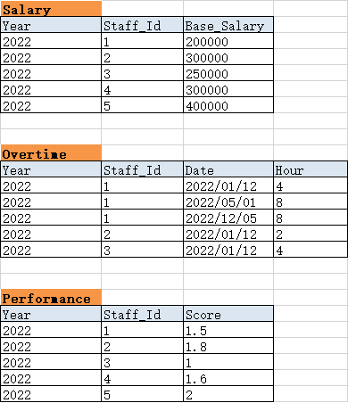
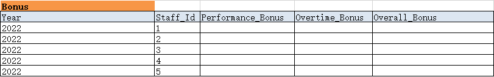

基于 Spark 构建的计算员工奖金程序。

# 业务需求

统计员工奖金

奖金 = 绩效奖金 + 额外加班奖金

**PART 1**

额外加班奖金 = 员工日工资 * 加班天数 * 公司效益系数

- 员工日工资 = 基本年工资/12/30,详见 `Salary` 表
- 加班天数，详见 `Overtime` 表
- 公司效益系数，详见 `Profit` 表

**PART 2**

绩效奖金 = 员工月工资 * 绩效系数 * 实际工作月数/12 * 公司效益系数

- 员工月工资 = 基本年工资/12,详见 `Salary` 表
- 绩效系数计算,详见 `Performance` + `Performance_Metrics` 表
- 实际工作月数，详见 `Attendance` + `Attendance_Metrics` 表
- 公司效益系数，详见 `Profit` 表

# 输入

样例，详见 `resources/*tables`

# 输出

样例，详见 程序运行后`控制台的日志`

